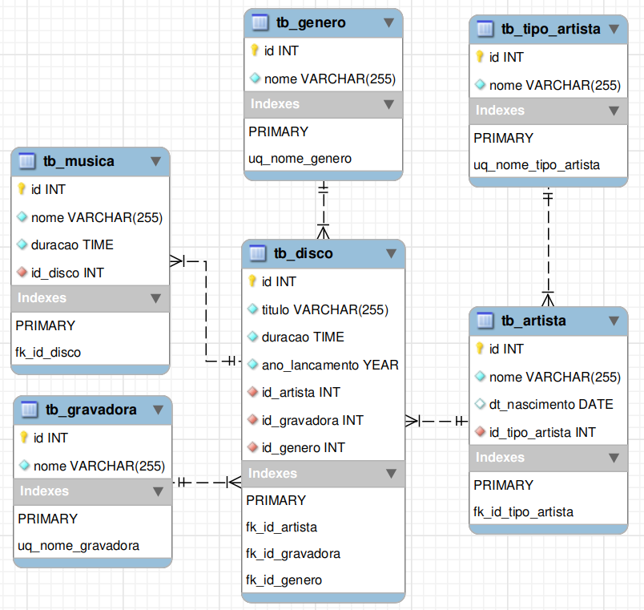

# DB_DISCOTECA DATABASE:
---
Este banco de dados tem objetivo educacional e foi desenvolvido junto aos alunos do curso profissionalizante de DBA.

Abaixo você encontrá uma breve descrição dos objetos implementados neste banco e o script SQL desenvolvido.

## Modelagem lógica

## Chaves primarias de cada tabela
    
Aqui podemos ver as chaves primarias e suas respectivas tabelas.
    
|TABLES|PRIMARY KEYS|
|:-|:-:|
|gravadora |id|
|artista   |id|
|genero|id|
|disco|id|
|musica|id|

## Chaves estrangeiras e seus relacionamentos

|FOREIGN KEYS|CONSTRAINT|RELATIONS|
|-|-|-|
|id_gravadora|fk_id_gravadora|tb_disco <--- tb_gravadora|
|id_artista|fk_id_artista|tb_disco  <--- tb_artista|
|id_genero|fk_id_genero|tb_disco  <---- tb_genero|
|id_disco|fk_id_disco|tb_musica <--- tb_disco|
|id_tipo_artista|fk_id_tipo_artista|tb_artista <--- tb_tipo_artista|
