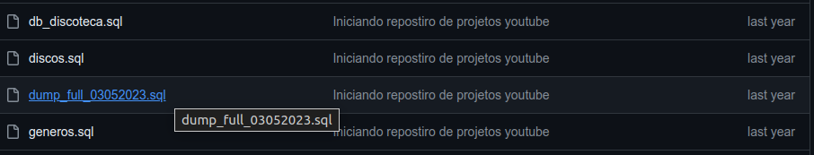
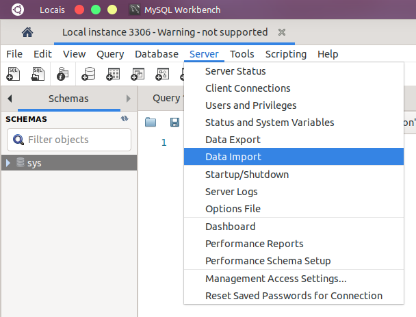

# DB_DISCOTECA DATABASE:
---
Este banco de dados tem objetivo educacional e foi desenvolvido junto aos alunos do curso profissionalizante de DBA.

Abaixo você encontrá uma breve descrição dos objetos implementados neste banco e o script SQL desenvolvido.

## ARQUITETURA

### Modelagem lógica

### Chaves primarias de cada tabela
    
Aqui podemos ver as chaves primarias e suas respectivas tabelas.
    
|TABLES|PRIMARY KEYS|
|:-|:-:|
|gravadora |id|
|artista   |id|
|genero|id|
|disco|id|
|musica|id|

### Chaves estrangeiras e seus relacionamentos

|FOREIGN KEYS|CONSTRAINT|RELATIONS|
|-|-|-|
|id_gravadora|fk_id_gravadora|tb_disco <--- tb_gravadora|
|id_artista|fk_id_artista|tb_disco  <--- tb_artista|
|id_genero|fk_id_genero|tb_disco  <---- tb_genero|
|id_disco|fk_id_disco|tb_musica <--- tb_disco|
|id_tipo_artista|fk_id_tipo_artista|tb_artista <--- tb_tipo_artista|

 

## TUTORIAL DE USO
### Modo automático

#### Download do dump
Baixe o arquivo dump_full_03052023.sql para isso basta clicar nele no topo da pagina.

Em seguida clique em download raw e aguarde o download finalizar.

#### Criando o banco de dados no seu servidor local

Usando o seu MySQL Workbench com o seu servidor mysql rodando, cliquem em 'Server' e depois em 'Data Import' 

Selecione o arquivo baixado no seu computador, na opção 'Self-Contained File'

Crie um banco com o nome 'db_discoteca'

Cliquem em 'Start Import' e agurada finalizar a importação

Atualize a sua lista de banco de dados e pronto, pode começar a usar este banco de dados para seus estudos.

 
 

## PROFESSOR LUCIANO LOPES

[Visite o meu canal no youtube!](https://www.youtube.com/@proletariovencedor?sub_confirmation=1)

