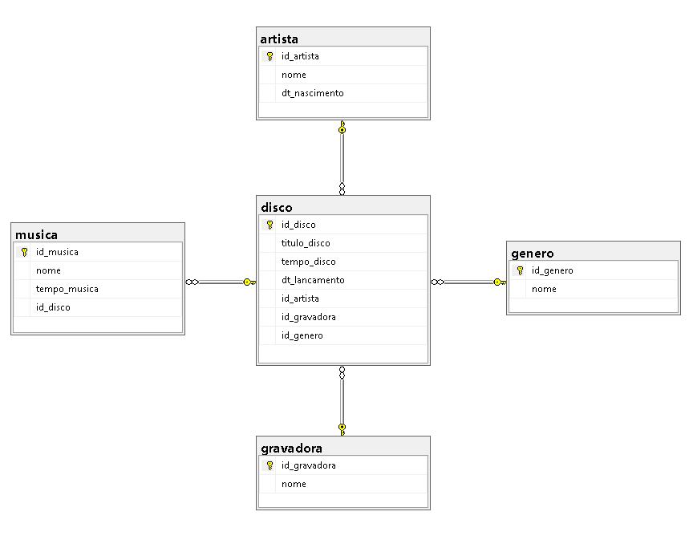

# **db_discoteca:**

Este banco de dados tem objetivo educacional e foi desenvolvido junto aos alunos do curso de aperfeiçoamento em SQL Server.

Abaixo você encontrá uma breve descrição dos objetos implementados neste banco e ainda neste repositorio tera acesso ao script da implementanção fisica para que posso estudar e realizar seus proprios testes em SQL Server.


<div align="center">

## ARQUITETURA



</div>

## **CONSTRAINS PADRONIZADAS**
    

Aqui podemos ver as chaves primarias e suas respectivas constraints, também podemos ver as constraints CHECK e valores padrões estabelecidos por DEAFULT em uma coluna da tabela.

    
|TABLES|PRIMARY KEYS|CONSTRAINTS|CONSTRAINT CHECK|DEFAULT VALUES|
|:-|:-:|:-|:-:|:-:|
|gravadora |id_gravadora|PK_id_gravadora|-|Independente|
|artista   |id_artista|PK_id_artista|-|Desconhecido|
|genero|id_genero|PK_id_genero|-|- Outros|
|disco|id_disco|PK_id_disco|-|0|
|musica|id_musica| PK_id_musica|CK_tempo_musica|-|

## **CHAVES ESTRANGEIRAS E SEUS RELACIONAMENTOS**

|FOREIGN KEYS|CONSTRAINT|RELATIONS|
|-|-|-|
|id_gravadora|FK_id_gravadora|disco - gravadora|
|id_artista|FK_id_artista|disco  - artista|
|id_genero|FK_id_genero|disco  - genero|
|id_disco|FK_id_disco|musica - disco|

## **TRIGGERS** 
|TRIGGER|DESCRICAO|
|-|-|
|tr_tempo_disco_insert|automatiza o tempo total do disco contabilizando pela soma do tempo de musicas cadastradas|

##	**FUNCTIONS**

|FUNCTION|DESCRICAO|
|-|-|
|dbo.fn_inicial_maiuscula|Converte em maiuscula a primeira letra de cada palavra em uma string|

##	**VIEWS**


|VIEW|DESCRICAO|
|-|-|
|vw_dados_disco|disponibiliza os dados completos do disco ja integrando sua gravadora e artista|
|vw_musicas|exibe as musicas ja com o nome do seu respectivo disco e artista|
|vw_artistas|exibe nome e idade dos artistas acompanhados de quantos discos cada um possui cadastrados|
|vw_gravadora|exibe o nome de cada gravadora e a quantidade de discos de cada uma|


## **PROCEDURES**
- **sp_insert_gravadora**
    - insere uma nova gravadora       

 **PARAMETROS**

- sp_insert_gravadora (@g_nome);
    - @g_nome  ---- sera o nome da gravadora a ser inserida.
        
**EXEMPLO DE USO**

```sql
EXEC sp_insert_gravadora 'Universal'
GO
```
---
- **SP_insert_genero**
    - insere um novo genero musical       

 **PARAMETROS**

- sp_insert_genero (@ge_nome);
    - @ge_nome 	----- sera o nome do genero a ser inserido.
        
**EXEMPLO DE USO**

```sql
EXEC sp_insert_genero 'Rock'
GO
```
---

- **sp_insert_artista**
    - insere um artista      

 **PARAMETROS**

- sp_insert_artista (@a_nome , @nascimento);
    - @a_nome         ------- deve ser o nome do artista,
    - @nascimento     ------- deve ser sua data de nascimento no formato 'YYYY-MM-DD'
        
**EXEMPLO DE USO**

```sql
EXEC sp_insert_artista 'Luciano', '1993-09-09'
GO
```
---

- **sp_insert_disco**
    - insere um disco      

 **PARAMETROS**

- sp_insert_disco (@d_titulo, @dt_lancamento, @cod_artista, @cod_gravadora, @cod_genero);

    -	@d_titulo		------titutlo do disco a ser inserido
    -	@dt_lancamento	------data de lancamento do disco a ser inserido
    -	@cod_artista	------codigo do artista do disco
    -	@cod_gravadora	------codigo da gravadora responsavel pelo disco
    -	@cod_genero		------codigo do genero do disco
        
**EXEMPLO DE USO**

```sql
EXEC sp_insert_disco 'Forro do Bom', '1993','3','3','3'
GO
```
---

- **sp_insert_musica**
    - insere uma música      

 **PARAMETROS**

- sp_insert_musica (@titulo , @duracao , @cod_disco );
    - @titulo		----- nome da musica a ser inserida
    - @duracao		----- tempo de duração de uma musica
    - @cod_disco	----- aqui deve ser inserido o codigo do disco ao qual pertence a musica
    
**EXEMPLO DE USO**

```sql
EXEC sp_insert_musica 'cada um no seu quadrado', '4.2','3'
GO
```
---