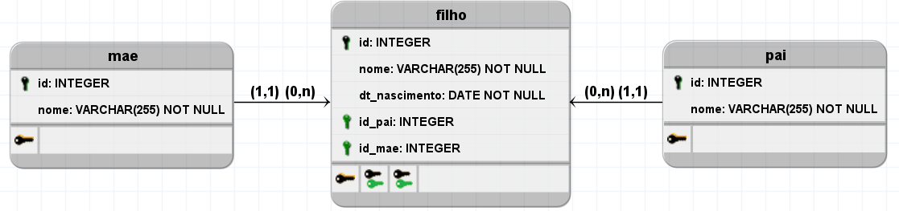
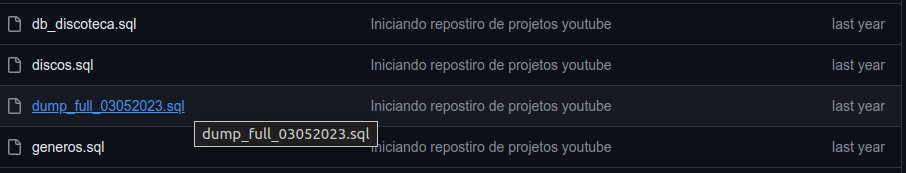
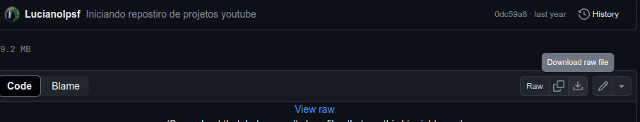
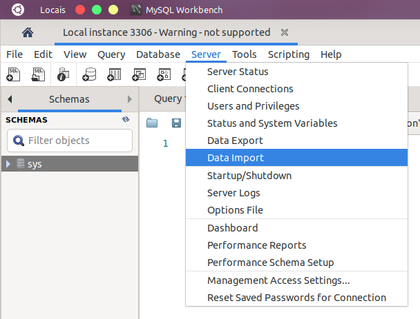
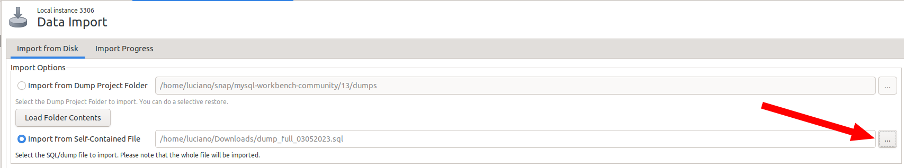
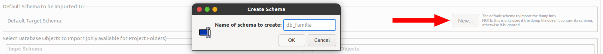
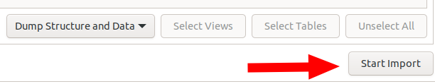
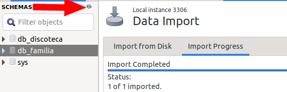

# DB_FAMILIA DATABASE
---
Este banco de dados tem objetivo educacional 

Abaixo você encontrá uma breve descrição dos objetos implementados neste banco e ainda neste repositorio tera acesso ao script da implementanção fisica para que posso estudar e realizar seus proprios testes em SQL.

### Modelagem lógica

### Constraints padronizadas
    

Aqui podemos ver as chaves primarias e suas respectivas tables.
    
|TABLES|PRIMARY KEYS|DEFAULT VALUES|
|:-|:-:|:-:|
|tb_pai |id|-|
|tb_mae  |id|-|
|tb_filho|id|-|

### Chaves estrangeiras e seus relacionamentos

|FOREIGN KEYS|CONSTRAINT|RELATIONS|
|-|-|-|
|id_pai|fk_id_pai|tb_filho   <---   tb_pai|
|id_mae|fk_id_mae|tb_filho   <---   tb_mae|

## TUTORIAL DE USO
### Modo automático

#### Download do dump
Baixe o arquivo dump_full_03052023.sql para isso basta clicar nele no topo da pagina.

Em seguida clique em download raw e aguarde o download finalizar.

#### Criando o banco de dados no seu servidor local

Usando o seu MySQL Workbench com o seu servidor mysql rodando, cliquem em 'Server' e depois em 'Data Import' 

Selecione o arquivo baixado no seu computador, na opção 'Self-Contained File'

Crie um banco com o nome 'db_familia'

Cliquem em 'Start Import' e agurada finalizar a importação

Atualize a sua lista de banco de dados e pronto, pode começar a usar este banco de dados  db_familia para seus estudos.

 
 

## PROFESSOR LUCIANO LOPES

[Visite o meu canal no youtube!](https://www.youtube.com/@proletariovencedor?sub_confirmation=1)

