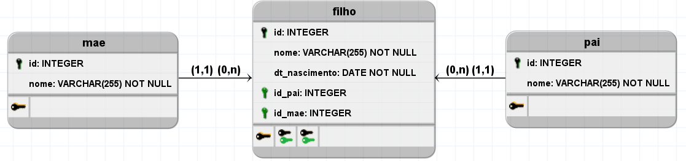

# DB_FAMILIA DATABASE
---
Este banco de dados tem objetivo educacional 

Abaixo você encontrá uma breve descrição dos objetos implementados neste banco e ainda neste repositorio tera acesso ao script da implementanção fisica para que posso estudar e realizar seus proprios testes em SQL.

## Modelagem lógica

## Constraints padronizadas
    

Aqui podemos ver as chaves primarias e suas respectivas tables.
    
|TABLES|PRIMARY KEYS|DEFAULT VALUES|
|:-|:-:|:-:|
|tb_pai |id|-|
|tb_mae  |id|-|
|tb_filho|id|-|

## Chaves estrangeiras e seus relacionamentos

|FOREIGN KEYS|CONSTRAINT|RELATIONS|
|-|-|-|
|id_pai|fk_id_pai|tb_filho   <---   tb_pai|
|id_mae|fk_id_mae|tb_filho   <---   tb_mae|