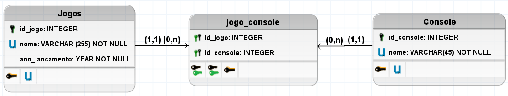

# DB_GAME DATABASE
---
Este banco de dados tem objetivo educacional 

Abaixo você encontrá uma breve descrição dos objetos implementados neste banco e ainda neste repositorio tera acesso ao script da implementanção fisica para que posso estudar e realizar seus proprios testes em SQL.

## Modelagem lógica

## Constraints padronizadas

Aqui podemos ver as chaves primarias e suas respectivas constraints.
    
|TABLES|PRIMARY KEYS|DEFAULT VALUES|
|:-|:-:|:-:|
|tb_jogo |id|-|
|tb_console   |id|-|
|tb_jogo_console|id_jogo|-|
|tb_jogo_console|id_console|-|

## Chaves estrangeiras e seus relacionamentos

|FOREIGN KEYS|CONSTRAINT|RELATIONS|
|-|-|-|
|id_jogo|fk_id_jogo|tb_jogo    --->  tb_jogo_console|
|id_console|fk_id_console|tb_console   --->   tb_jogo_console|

