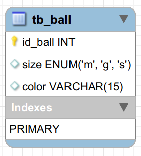
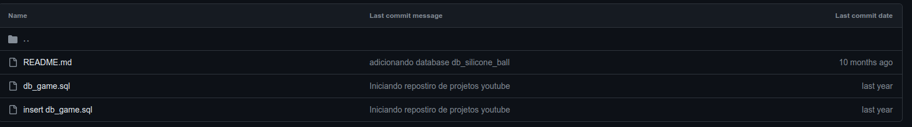
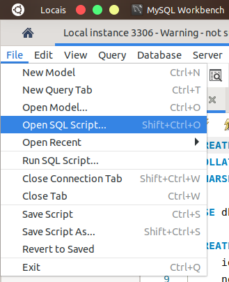

# DB_SILICONE_BALL DATABASE
---
Este banco de dados tem objetivo educacional 

Abaixo você encontrá uma breve descrição dos objetos implementados neste banco e ainda neste repositorio tera acesso ao script da implementanção fisica para que posso estudar e realizar seus proprios testes em SQL.

## Modelagem lógica

## Constraints padronizadas

Aqui podemos ver as chaves primarias e suas respectivas constraints.
    
|TABLES|PRIMARY KEYS|DEFAULT VALUES|
|:-|:-:|:-:|
|tb_ball |id_ball|-|

## Legenda

Para esta database temos as seguintes letras representando o tamanho:

|caracter|word|
|:-|:-:|
|g|great|
|m|medium|
|s|small|

## TUTORIAL DE USO
### Modo manual

#### Download do script
Baixe os arquivos db_silicone_ball.sql e insert_db_silicone_ball.sql para isso basta clicar neles no topo da pagina.

Em seguida copie os codigos ou clique em download raw e aguarde o download finalizar.

#### Criando o banco de dados no seu servidor local

Usando o seu MySQL Workbench com o seu servidor mysql rodando, clique em 'File' e depois em 'Open SQL Script' e escolha seus arquivos baixados. 

Execute o script 'db_silicone_ball.sql' por completo e depois execute o script 'insert_db_silicone_ball.sql' para inserir os dados em suas respectivas tabelas.

 
 

## PROFESSOR LUCIANO LOPES

[Visite o meu canal no youtube!](https://www.youtube.com/@proletariovencedor?sub_confirmation=1)

