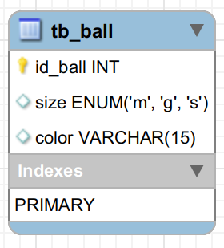

# DB_SILICONE_BALL DATABASE
---
Este banco de dados tem objetivo educacional 

Abaixo você encontrá uma breve descrição dos objetos implementados neste banco e ainda neste repositorio tera acesso ao script da implementanção fisica para que posso estudar e realizar seus proprios testes em SQL.

## Modelagem lógica

## Constraints padronizadas

Aqui podemos ver as chaves primarias e suas respectivas constraints.
    
|TABLES|PRIMARY KEYS|DEFAULT VALUES|
|:-|:-:|:-:|
|tb_ball |id_ball|-|

## Legenda

Para esta database temos as seguintes letras representando o tamanho:

|caracter|word|
|:-|:-:|
|g|great|
|m|medium|
|s|small|